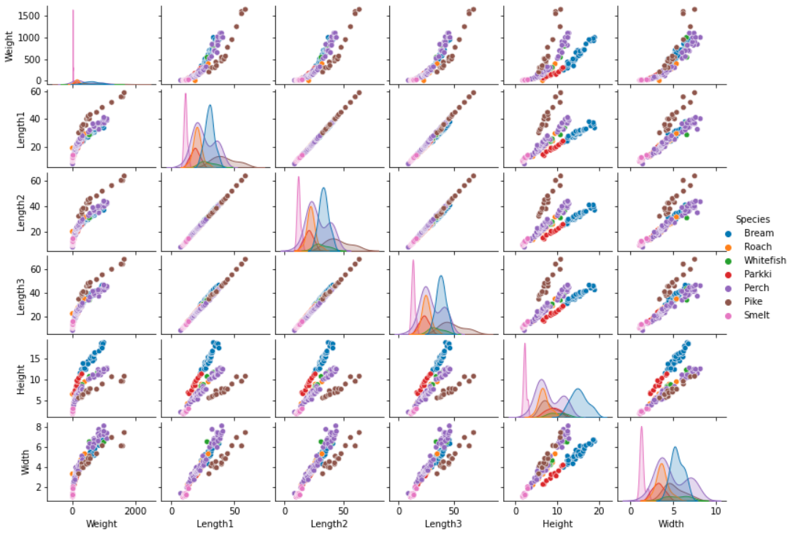

# Fish-weight-prediction-with-popular-regression-models
This proejct uses Fish market [kaggle dataset](https://www.kaggle.com/datasets/aungpyaeap/fish-market).

## EDA of the dataset 
### Pairwise relationships in a dataset

### Visualize the outliers of the dataset

### Visualize relationships between variables of dataset

### Distribution of the dataset after standardization and noise removal 

## Results of the models 

### A learning curve for Random forest regressor

