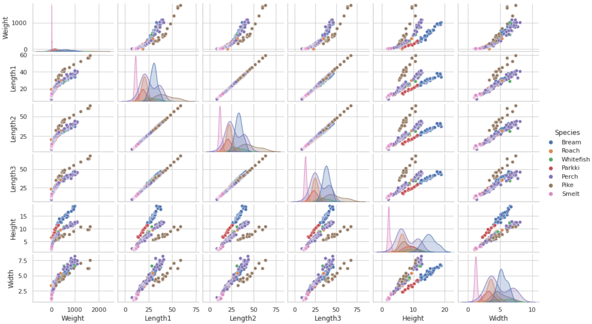

# Fish-weight-prediction-with-popular-regression-models

##  Linear regression modles
- Linear regression models are supervised machine learning algorithms which predicts target variable Y based on Independent variables X.

                           Y = wx+ b
   
Where :-  
 -  w is intercept in the y-axis
 -  b is a slope
 - w and b are trainable parameters(also referred coefficients, weights). 
 The goal is to find w and b such that we minimize the cost function 

This proejct uses Fish market [kaggle dataset](https://www.kaggle.com/datasets/aungpyaeap/fish-market).

## EDA of the dataset 
### Pairwise relationships in a dataset

### Visualize the outliers of the dataset

### Distribution of the dataset after standardization and noise removal 

### Visualize relationships between variables of dataset

## Results of the models 
   
    

<table border="1" class="dataframe">
  <thead>
    <tr style="text-align: right;">
      <th></th>
      <th>Linear_regression</th>
      <th>Decission_Tree</th>
      <th>Random_Forest</th>
      <th>XGboots_Regressor	</th>
      <th>LGBM_Regressor</th>
      <th>CatBoost_Regressor</th>
      <th>SGD_Regressor</th>
      <th>Kernel_Ridge</th>
      <th>Elastic_Net</th>
      <th>Bayesian_Ridge</th>
      <th>GradientBoosting_Regressor</th>
      <th>SVR</th>
    </tr>
  </thead>
  <tbody>
    <tr>
      <th>MSE</th>
      <td>0.08</td>
      <td>0.05</td>
      <td>0.02</td>
      <td>0.03</td>
      <td>0.03</td>
      <td>0.03</td>
      <td>0.10</td>
      <td>0.10</td>
      <td>0.52</td>
      <td>0.08</td>
      <td>0.03</td>
      <td>0.02</td>
    </tr>
       <tr>
      <th>MAE</th>
      <td>0.23</td>
      <td>0.16</td>
      <td>0.09</td>
      <td>0.13</td>
      <td>0.12</td>
      <td>0.10</td>
      <td>0.26</td>
      <td>0.26</td>
      <td>0.62</td>
      <td>0.23</td>
      <td>0.12</td>
      <td>0.09</td>
    </tr>
       <tr>
      <th>R_squred</th>
      <td>0.89</td>
      <td>0.94</td>
      <td>0.98</td>
      <td>0.96</td>
      <td>0.97</td>
      <td>0.97</td>
      <td>0.86</td>
      <td>0.86</td>
      <td>-3.87</td>
      <td>0.89</td>
      <td>0.97</td>
      <td>0.98</td>
    </tr>
  </tbody>
</table>

### A learning curve for Random forest regressor

###  Residual Plot

